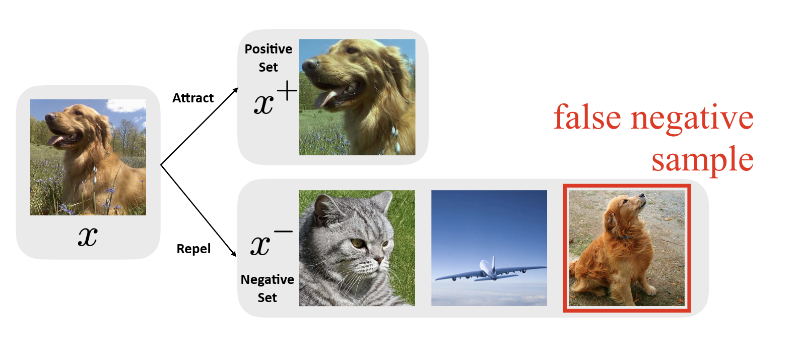
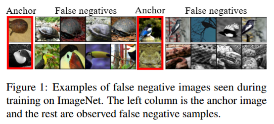

# GloFND
Code for the ICML 2025 paper, [***Discovering Global False Negatives On the Fly for Self-supervised Contrastive Learning***](https://arxiv.org/abs/2502.20612)

[arXiv](https://arxiv.org/abs/2502.20612)
[ICML 2025](https://icml.cc/virtual/2025/poster/45576)

---

We propose a novel method to efficiently discover global false negatives for self-supervised contrastive learning. Our method, **Glo**bal **F**alse **N**egative **D**etection (*GloFND*), is designed to enhance contrastive learning models by identifying global false negatives during training so they can be treated appropiately (e.g., being removed from the negative set). GloFND is a simple and efficient method that can be combined with contrastive learning frameworks with negligible computational cost, including unimodal and bimodal scenarios.



In this repo, we show how to use *GloFND* for *global contrastive learning* in the unimodal and bimodal scenarios.

**Table of Contents**
- [Lay Summary](#lay-summary)
- [Cite](#cite)

## Lay Summary

Modern AI systems can learn to understand images even without being told what each image shows—a technique known as self-supervised learning. A common method is contrastive learning, where the AI compares images, bringing similar ones closer and pushing different ones apart. This creates a vector representation for each image, useful for tasks like object classification and image–text search. But without labels, the model assumes all images are different, leading to false negatives—related images, like two dog breeds, mistakenly treated as unrelated. These errors weaken learning, and checking all possible image pairs is impractical for large datasets with millions of images.

We present *GLOFND*, a method that automatically detects false negatives during training. Unlike prior approaches that depend on limited samples or intensive computation, *GLOFND* searches across the full dataset by learning a custom similarity threshold for each image. It does so while keeping computation costs low and independent of dataset size.

*GLOFND* improves the quality of vector representations and yields more accurate results on tasks like classification and image–text retrieval. It is easy to apply, handles large datasets effectively, and integrates seamlessly into existing contrastive learning frameworks, boosting their performance.



## Cite

If you find our work helpful, please cite our paper:
```bibtex
@misc{balmaseda2025discoveringglobalfalsenegatives,
      title={Discovering Global False Negatives On the Fly for Self-supervised Contrastive Learning}, 
      author={Vicente Balmaseda and Bokun Wang and Ching-Long Lin and Tianbao Yang},
      year={2025},
      eprint={2502.20612},
      archivePrefix={arXiv},
      primaryClass={cs.LG},
      url={https://arxiv.org/abs/2502.20612}, 
}
```
